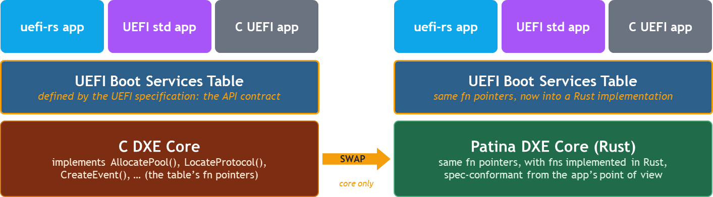
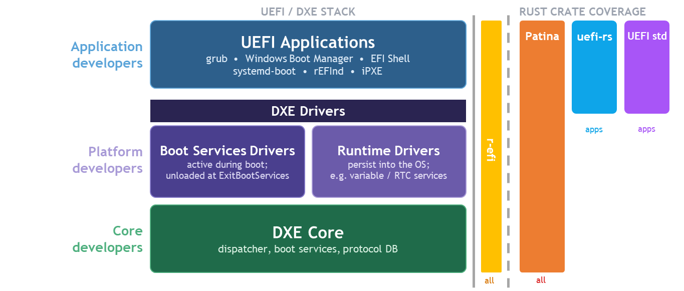
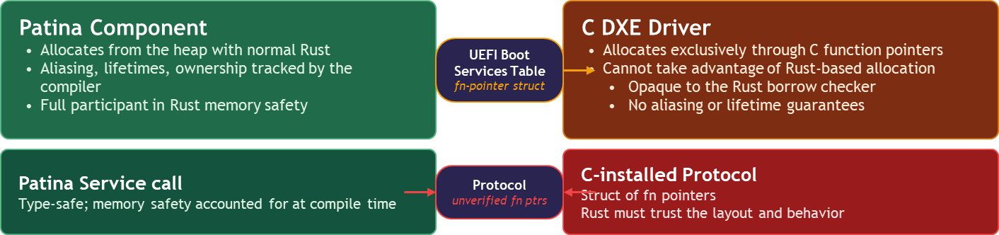

# Patina in the UEFI Rust Ecosystem

This section provides an overview of the most likely options you will encounter when first considering writing UEFI
firmware in Rust. The ecosystem is still in its early stages, but there are already a number of projects that have
been active for years.

- [r-efi](https://github.com/r-efi/r-efi)
  - *UEFI Reference Specification Protocol Constants and Definitions*. A pure transpose of the UEFI specification into
    Rust. This provides the raw definitions from the specification, without any extended helpers or Rustification. It
    serves as baseline to implement any more elaborate Rust UEFI layers.
- [uefi-rs](https://github.com/rust-osdev/uefi-rs)
  - *Safe and easy-to-use wrapper for building UEFI apps*. An elaborate library providing safe abstractions for UEFI
    protocols and features. It implements allocators and provides an execution environment to UEFI applications written
    in Rust.

Though not a project, you can also write UEFI code using [uefi std](https://github.com/rust-lang/rust/issues/100499)
support tracked by the official Rust language. Additionally, more information about the [*-unknown-uefi](https://doc.rust-lang.org/beta/rustc/platform-support/unknown-uefi.html)
target is a great place to understand information that applies to all UEFI Rust projects building against that target.

It is important to understand that Patina is fundamentally different from these projects.

| Aspect | Patina | uefi-rs | r-efi | uefi std |
|---|---|---|---|---|
| **Abstraction level** | High-level firmware framework | High-level safe abstractions | Low-level raw bindings | Standard library port |
| **Target use case** | Full firmware implementation ground up in Pure Rust | UEFI applications & drivers | Simple spec type bindings reused in other implementations | UEFI applications |
| **Safety** | Safe Rust APIs | Safe Rust APIs | Unsafe raw FFI | Safe Rust APIs |
| **Opinionated design** | Yes | Moderate | No | No

Because of the "raw" nature of `r-efi`, it is used in many other places including Patina and `uefi-rs`. `uefi-rs` and
Rust std support provide a path to write UEFI applications (and to some extent, DXE drivers) in Rust using safe and
ergonomic interfaces. They are both compatible with an underlying core written in C (such as [Tianocore EDK II](https://github.com/tianocore/edk2))
or Rust (such as Patina) since UEFI Specification defined interfaces like the [Boot Services table](https://uefi.org/specs/UEFI/2.11/07_Services_Boot_Services.html)
serve as a common abstraction.

Patina, implements the entire core environment in Rust with a design that supports porting drivers to Pure Rust over
time while providing backward compatibility with Platform Initialization (PI) Specification dispatch. Therefore,
while Patina provides an [SDK](https://crates.io/crates/patina) that can be used for general-purpose UEFI development,
its main focus is to write the entire execution environment in Rust as opposed to a wrapper around services that
ultimately are implemented in C. Due to this, Patina has an audience ranging from core developers to application
developers.

By writing the core in Rust, Patina provides a unique opportunity to leverage Rust's safety and other language features
up and down the entire DXE build for a given platform. A key goal of Patina is to leverage this by porting more
DXE drivers to Patina components over time that use idiomatic Rust interfaces while maintaining backward compatibility
with the remaining DXE drivers.

In particular, a call to action for the ecosystem is to port those existing drivers to Patina components.
Because there are hundreds of DXE drivers in a typical platform today, Patina components are likely to depend on
functionality in some code that is not ported yet and we lose some of the benefits of Rust's safety when we have to call
back into C code.

When a C DXE driver installs a protocol that Patina-based code must consume, the Rust compiler cannot verify the
struct’s function pointers behave safely. We are forced to trust the layout and the implementation.

A Patina Service call, by contrast, is fully accounted for at compile time. Aliasing, lifetimes, and ownership all
checked end-to-end. Read [Getting Started with Components](../component/getting_started.md) for more information.
